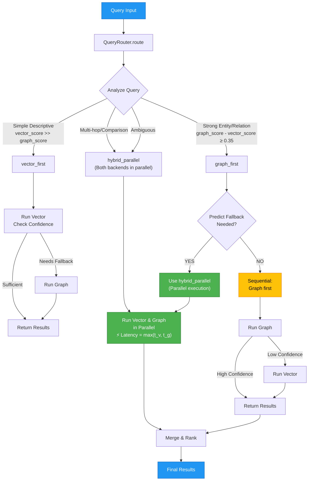

# Diagram 1: Query Flow After Optimization

## HAMH-RAG Route Optimization: Query Flow After Optimization

Shows how queries are routed through the intelligent routing system with fallback prediction.

- **Green (⚡)** = Parallel execution paths (optimized)
- **Orange** = Graph-first path with prediction
- **Blue** = Input/Output

