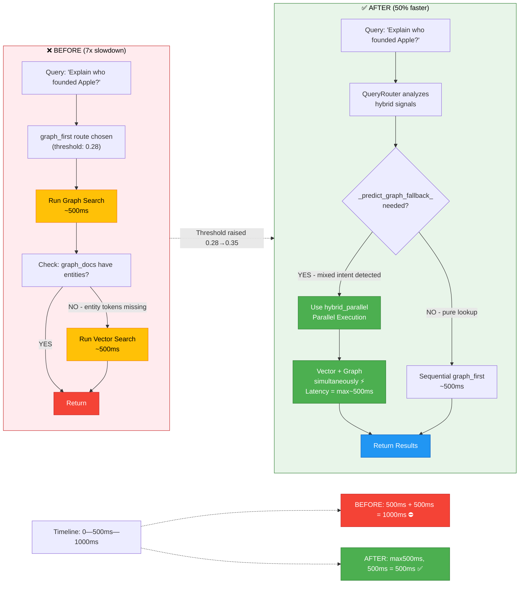

# Diagram 2: Before vs After Optimization

## Optimization: Before vs After - Eliminating Sequential Bottleneck

Visual comparison of sequential execution (before optimization) vs parallel execution (after optimization).

- **Red** = Sequential execution (slow ⛔)
- **Green** = Parallel execution (fast ✅)
- **Blue** = Final results

### Key Insights

- **Before**: Queries like "Explain who founded Apple?" were routed to `graph_first` (threshold 0.28), then when graph results were weak, vector search was triggered sequentially (~1000ms total)
- **After**: The same query now either stays sequential (if pure lookup) or switches to parallel execution early (~500ms total)
- **Threshold Change**: 0.28 → 0.35 makes the router more conservative, pushing borderline queries to parallel execution
- **Speedup**: ~1.98x faster (50% latency reduction)
