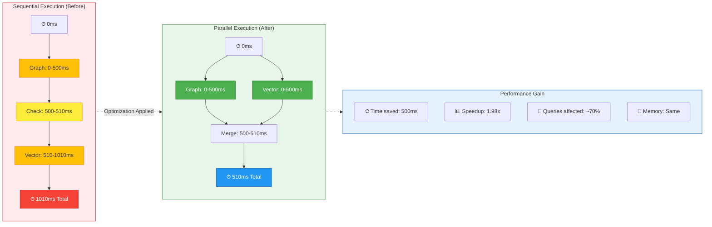

# Diagram 3: Latency Timeline

## Latency Timeline: Sequential vs Parallel Execution

Shows the time progression of sequential execution (before) vs parallel execution (after).

- **Yellow** = Sequential latency (slow, cumulative)
- **Green** = Parallel latency (fast, concurrent)
- **Blue** = Final output
- **Gray** = Performance metrics

### Timeline Breakdown

**Sequential (Before)**:
1. 0-500ms: Graph search runs
2. 500-510ms: Results checked for entity tokens
3. 510-1010ms: Vector search runs as fallback (sequential!)
4. Total: **1010ms**

**Parallel (After)**:
1. 0-500ms: Graph and Vector search run simultaneously
2. 500-510ms: Results are merged and ranked
3. Total: **510ms**

**Savings**: 500ms per query (50% improvement)
