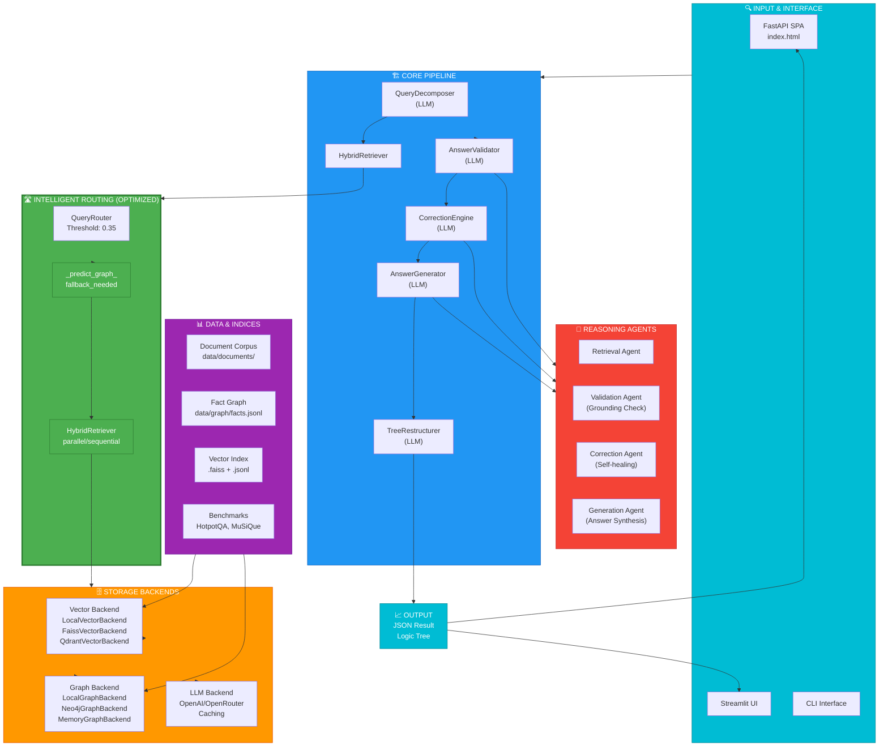

# Diagram 4: System Architecture Overview

## Complete System Architecture: TreeQA with Optimized Routing

Shows the complete system components and how they interact, with the optimized routing highlighted in green.

- **Green (⚡)** = Optimized intelligent routing (NEW)
- **Blue** = Core pipeline components
- **Orange** = Storage backends
- **Purple** = Data & indices
- **Cyan** = User interfaces
- **Red** = Reasoning agents

### Component Details

**Input Interfaces**:
- FastAPI SPA: Web-based interactive UI with live routing visualization
- Streamlit UI: Alternative dashboard interface
- CLI: Command-line interface for batch processing

**Core Pipeline**:
- QueryDecomposer: Breaks complex questions into sub-questions using LLM
- HybridRetriever: Fetches evidence from multiple backends
- AnswerValidator: Checks grounding and entity alignment
- CorrectionEngine: Self-healing loop for invalid answers
- AnswerGenerator: Synthesizes final answer from evidence
- TreeRestructurer: Optional tree reorganization

**Intelligent Routing** (⚡ Optimized):
- QueryRouter: Analyzes query intent and selects best route
- Fallback Prediction: Predicts if sequential execution will need fallback
- HybridRetriever: Executes parallel or sequential based on prediction

**Storage Backends**:
- Vector: Semantic similarity search (FAISS, Qdrant, Local)
- Graph: Structured fact retrieval (Neo4j, Local, Memory)
- LLM: Language model API calls with built-in caching

**Data Sources**:
- Document Corpus: Raw unstructured documents
- Fact Graph: Structured knowledge base
- Vector Index: Pre-computed embeddings
- Benchmarks: Evaluation datasets
