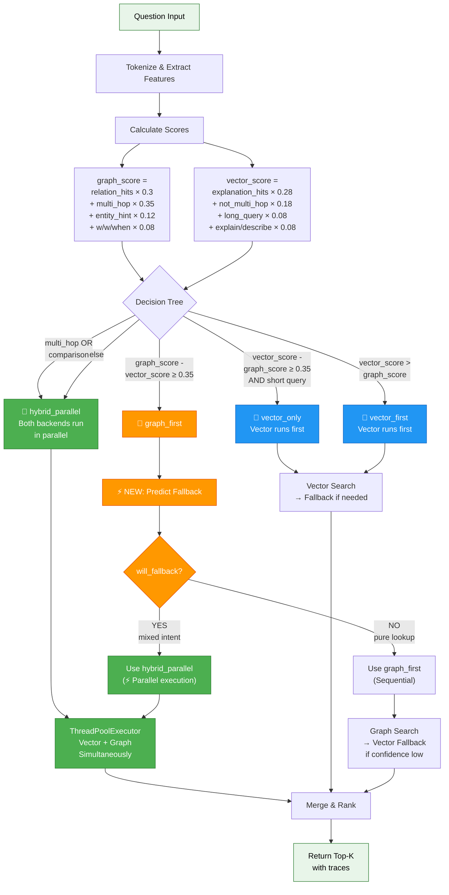

# Diagram 5: Intelligent Routing Decision Tree

## Routing Decision Tree: How Queries Are Classified

Shows the complete decision tree used to classify queries and select optimal retrieval strategy.

- **Green (⚡)** = Parallel execution paths (optimized)
- **Orange** = Graph-first with fallback prediction
- **Blue** = Vector-first paths
- **Light green** = Input/Output



### Decision Tree Logic

**Step 1: Feature Extraction**
- Extract tokens and analyze query structure
- Identify capitalized words (entities)
- Count keyword occurrences

**Step 2: Score Calculation**
- **graph_score**: How much the query needs structured data (entity lookups, relationships)
- **vector_score**: How much the query needs semantic understanding (explanations, descriptions)

**Step 3: Route Selection**
1. If multi-hop or comparison detected → **hybrid_parallel** (both at once)
2. If graph_score - vector_score ≥ 0.35 → **graph_first** (strong entity signals)
3. If vector_score - graph_score ≥ 0.35 AND short → **vector_only** (simple lookup)
4. If vector_score > graph_score → **vector_first** (descriptive)
5. Else → **hybrid_parallel** (ambiguous, use both)

**Step 4: Fallback Prediction** (NEW - for graph_first only)
- Predict if fallback will be needed WITHOUT running actual search
- If YES (mixed intent) → Switch to **hybrid_parallel** (parallel execution ⚡)
- If NO (pure lookup) → Keep **graph_first** (sequential execution)

**Step 5: Execution**
- Execute the selected route with appropriate backend(s)
- Merge results from all backends
- Rank using RRF (Reciprocal Rank Fusion)
- Return top-K results with retrieval traces

### Example Classifications

```
"Who founded Apple?"
├─ Tokens: [who, founded, apple]
├─ graph_score: 0.80 (strong relation + entity)
├─ vector_score: 0.18 (weak explanation)
├─ Route: graph_first
├─ Fallback prediction: NO
└─ Execution: Sequential graph search

"Explain how machine learning works"
├─ Tokens: [explain, machine, learning, works]
├─ graph_score: 0.12 (no relations)
├─ vector_score: 0.82 (strong explanation)
├─ Route: vector_first
└─ Execution: Vector search + fallback if needed

"Compare Apple and Microsoft founders"
├─ Tokens: [compare, apple, microsoft, founders]
├─ Multi-hop detected: YES (compare)
├─ Route: hybrid_parallel
└─ Execution: Parallel (both backends)
```
