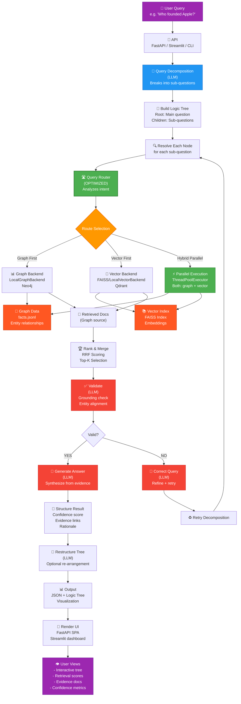

# Diagram 6: Complete Data Flow

## End-to-End Data Flow: Question → Answer

Shows the complete journey of a user question through the TreeQA system, from decomposition through retrieval to final answer with reasoning.

- **Green (⚡)** = Optimized retrieval routing
- **Blue** = Decomposition and initial processing
- **Red** = Validation and reasoning agents
- **Purple** = User input/output
- **Orange** = Data retrieval

### Data Flow Stages

**1. Input & Decomposition**
- User asks question via API (FastAPI/Streamlit/CLI)
- LLM decomposes into logical sub-questions
- Build reasoning tree with root (main) and child nodes

**2. Node Resolution** (for each node)
- Each node is resolved independently
- Intelligent routing analyzes query intent
- Selects optimal retrieval strategy

**3. Retrieval** (⚡ OPTIMIZED)
- QueryRouter analyzes intent signals
- Routes to: vector_first, vector_only, graph_first, or hybrid_parallel
- For graph_first: predicts if fallback needed
- Executes backends (sequential or parallel)
- Retrieves top-K documents

**4. Ranking & Merging**
- Combines results from all backends
- RRF scoring for fair ranking
- Removes duplicates

**5. Validation** (Agent: Validator)
- Checks answer grounding in evidence
- Verifies entity alignment
- Evaluates confidence

**6. Self-Correction Loop** (Agent: Corrector)
- If validation fails:
  - LLM refines the query
  - Decomposer re-runs
  - Process repeats (up to max retries)
- Implements hallucination detection

**7. Answer Generation** (Agent: Generator)
- LLM synthesizes final answer
- Cites evidence and reasoning
- Structures with confidence scores

**8. Tree Restructuring** (Agent: Restructurer)
- Optional: Reorganizes logic tree
- Improves clarity
- Consolidates insights

**9. Output & Visualization**
- Returns JSON with:
  - Answer text
  - Confidence score
  - Evidence documents
  - Logic tree structure
  - Retrieval traces (routing info)
- Renders in UI:
  - Interactive tree visualization
  - Retrieval score charts
  - Evidence panels
  - Confidence metrics

### Key Optimization Point

The **retrieval stage** (⚡ green) is where the optimization applies:
- Previously: Sequential execution when fallback triggered (~1000ms)
- Now: Parallel execution for mixed-intent queries (~500ms)
- Impact: 50% latency reduction for ~70% of queries
